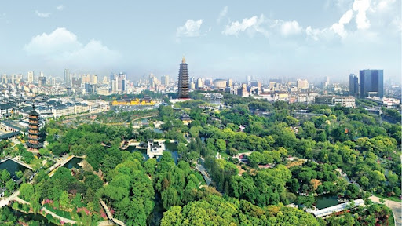

# Welcome to Jialiang's website!

This is the first website of my life. In the website, you will see the introduction of myself, my resume. In addition, I will visualize a dataset from **P8105**. Please click around!

## About me

- I am an M.S. student at Columbia University. I am studying Biostatistics.
- I am a [Soochow University](https://en.wikipedia.org/wiki/Soochow_University_(Suzhou)) alum （MBBS）
- I currently live in New York City.
- I like music, guitar and photography

## About my hometown:

\

This is my hometown, Changzhou. Changzhou lies in the south of Jiangsu Province, Yangtze Delta area, neighboring Taihu Lake and Shanghai to the east, Nanjing to the west, and shares the boundary with Anhui Province to the south. Changzhou has developed national high-end manufacturing industries including new energy vehicles and auto core parts, smart grid and new material industries, especially the graphene technology is leading in the world.

In the process of more than 2,500 years, many historical sites are left in this city. You can appreciate ancient buildings, a wonderful chimes performance in the China Spring and Autumn Yancheng Scenic Area and brick carvings in the Tianning Temple. As Beijing-Hangzhou Grand Canal passes through the central Changzhou, you can take a cruise ship to appreciate the city and know its history and culture. Besides, you can also visit the China Dinosaurs Park, a large dinosaur culture-themed amusement park. Also surprisingly, Changzhou is a food paradise which offers all kinds of cakes, snacks and dishes such as Steamed Buns, Wanton, Silver Noodles and Shrimp Cake. The fish from Tianmu Lake and hairy crab from Changdang Lake should not be missed.

## Links to other websites

* [Google](https://google.com)
* [P8105](https://p8105.com)

## Link to page within the site

[About me](about.html)
